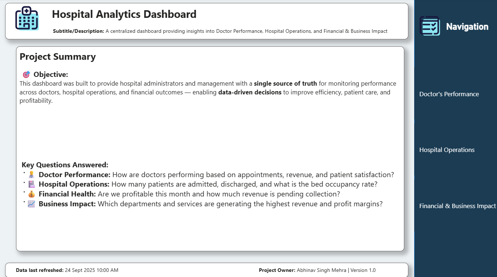
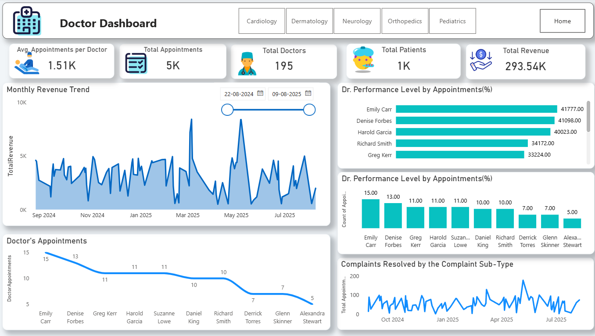

# 🏥 Hospital Analytics Dashboard

This project contains a complete analytics solution for hospital operations, doctors’ performance, and financial insights using **Power BI**.

## 🎯 Objective
To help hospital administrators monitor:
- Doctor performance & revenue
- Bed occupancy & patient admissions
- Financial health & profitability
- Department-wise patient load

## 🗄 Data Sources
- **EMR Database** (patients, admissions)
- **Billing Database** (invoices, revenue)
- **Generated sample data** using `populate_hospital.py`

## 📊 Dashboards
1. **Doctor Performance Dashboard**
2. **Hospital Operations Dashboard**
3. **Financial & Business Impact Dashboard**

## 🖼 Screenshots

## 🛠 How to Use
1. Clone or download the repository.
2. Open `.pbix` files in Power BI Desktop.
3. Connect to SQL Server or refresh sample data.

## 🧑‍💻 Tech Stack
- Power BI
- Python (Data population scripts)
- SQL Server (Database backend)

## 📌 Key Questions Answered
- How are our doctors performing?
- How many beds are available?
- Are we profitable this month?
- Which services generate the most revenue?
